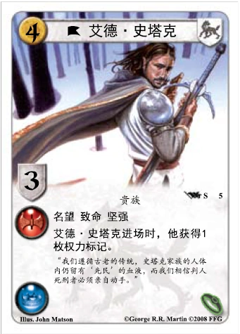

# Review: Game of Thrones – The Card Game

## Category: Board Game

**Recommendation Rating: 1/10**

**Beginner-Friendliness: 8/10**

**Difficulty Level: 8/10**

**Price: ¥198**

I never expected that the second board game I bought in college would be this heavy. While I love watching the TV series, I just couldn’t enjoy this card game. Later, I bought the board game version, which was much more fun.

This game is an **LCG** (Living Card Game), but I only purchased the base version and couldn’t figure out how to play it. I barely remember the rules now. Generally, both sides play roles from their hands, and each role has three abilities: red, green, and blue. If your values are higher than your opponent's in any of these, you score points, and the player with the most points at the end wins. The game requires balancing the values across the three colors.

**Pros**

1. Maybe it’s balanced?
2. Might appeal to hardcore fans of the TV series?

**Cons**

1. The rules are overly complex—I didn’t want to learn or teach them.
2. Requires deck-building, therefore hard to find anyone willing to play.
3. The gameplay itself is dull—just a contest of whose numbers are bigger.
4. It’s not that experience but not worth it.

I strongly do not recommend this game. I didn’t even play a full match with friends. I tried playing against myself after unboxing it and gave up right away.

# 测评 权力的游戏：卡牌版

## 类别： 桌游

**推荐指数： 1/10**

**入门指数： 8/10**

**难度指数： 8/10**

**价格： ¥198**

万万没想到我大学后买的第二个桌游就是这么重度的了。虽然我很爱看这部剧，但是对这款桌游实在是爱不起来，之后买的版图版要比它有趣的多。它是个 LCG，但我只买了它基础版，完全玩不明白。规则也不太记得了，大致是双方从手里打牌，每个人有红绿蓝三项能力，每项比对面高都能加分，最后比谁分多赢。要平衡好三种颜色的数值。

**优点**

1. 也许很平衡？
2. 可能适合电视剧狂热粉？

**缺点**

1. 规则很复杂，既不想学也不想教
2. 要自己组牌，很难找到人愿意玩
3. 对战也没什么意思，就是互相比大小
4. 还卖这么贵

非常不推荐了，我甚至都没有找伙伴打一局。拆开自己左右互搏了一把就放弃了。
