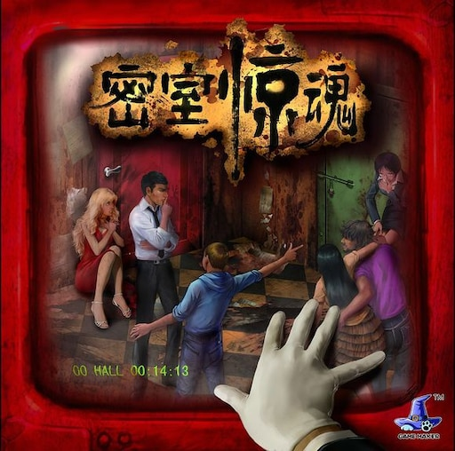

# 测评 密室惊魂

## 类别： 桌游

**推荐指数： 5/10**

**入门指数： 2/10**

**难度指数： 4/10**

**价格： ¥101.5**

从今天开始，对我十多年来在各大平台购买的商品进行一个测评，基本集中在淘宝和美国亚马逊。也不具备什么时效性了，就是纯粹记录一下。

翻了翻淘宝购物记录，第一件商品是在 2013 年 10 月 31 日购买的桌游密室惊魂，没想到我购买桌游的起点，是在本科入学两个月后。如果扣掉无聊的军训，就差不多是一个月就入坑桌游了。

这个桌游本身还是挺有意思的，属于密室逃脱。一共 12 个房间，分为两个状态四个颜色十二个编号。所有玩家要在规定的回合内搜集关于其中一个安全房间的线索，最后一起跑出去。而人群中可能还混入着会给出错误信息的奸徒。

**优点**

1. 规则相当简单直白，也没有什么文字量，门槛极低
2. 对于推理的要求不高，属于比较欢乐的类型了：

**缺点**

1. 设置的时候可以没有上帝，但是就会比较麻烦
2. 至少五人才能玩，人数要求有点高
3. 设置版图时候有随机性，但是都比较类似，玩两把可能就厌烦了

总体还是个合格的桌游，因此给了 5 分中间分。

