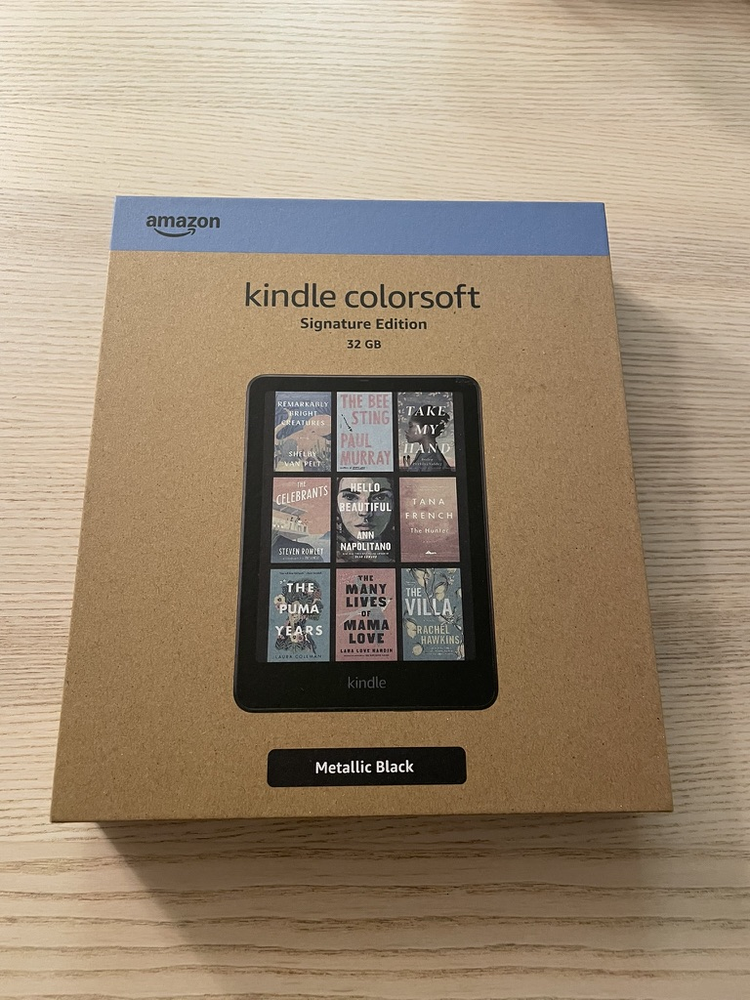
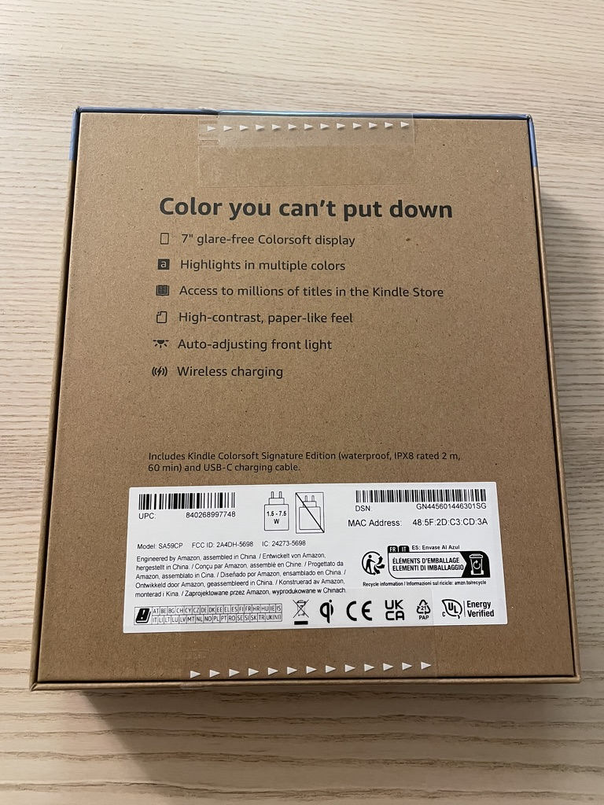
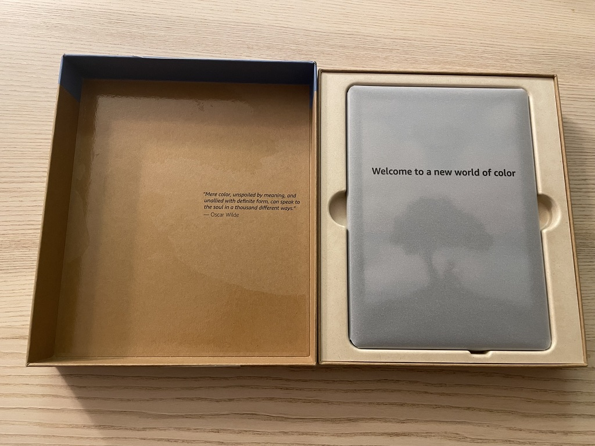
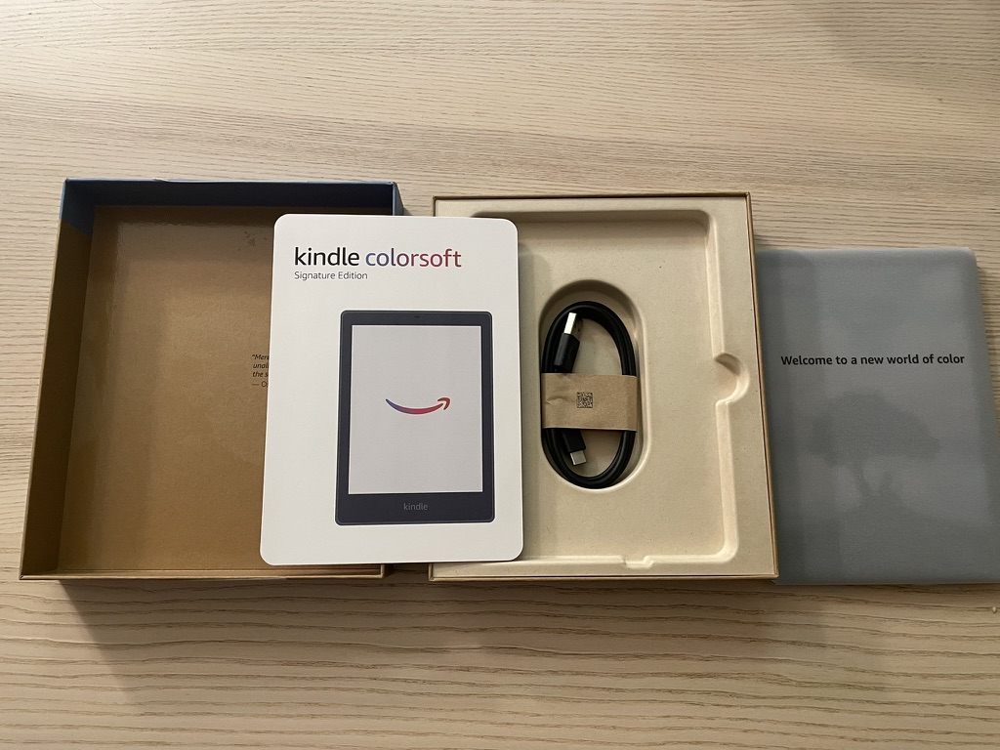
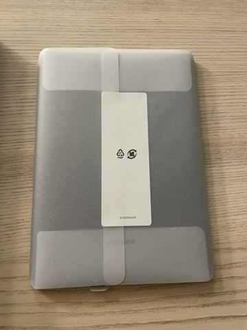
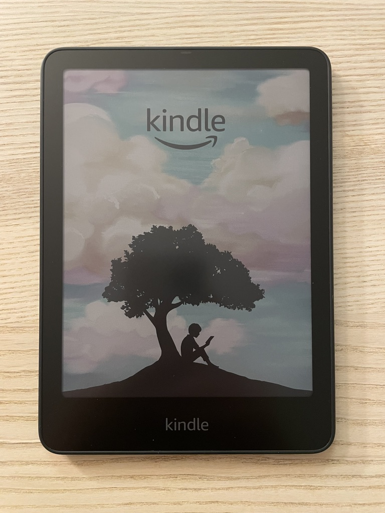

# Unbox - Kindle Colorsoft

## Category: Electronics

**Recommendation Rating:** ?/10

**Price:** $482.97 + Tax

**Purchase Date:** 2024/11/30 - 2024/12/17

After a two-week wait, the Kindle Colorsoft has finally arrived! To get this device, I traded in my Signature Edition Kindle. Lost quite a bit of money. Couldn't wait to unbox it right away.

The Kindle's packaging is quite eco-friendly, using paper-based boxes. The back of the box is sealed with just two adhesive strips, which easily snap off when pulled. However, it seems like the alignment of the seal wasn't quite perfect.

  
  

Upon opening, I found the packaging somewhat wasteful. The Kindle itself is very thin, but the box is this thick just to include an extra charging cable.

Speaking of which, here's a quick side note. I don't understand why there's so much negativity comments about not including a charging adapter. Personally, I like this policy because adapters are generally universal and rarely break. The ones included by manufacturers are often of low quality and not fast chargers. If you want fast charging, normally you have to buy one yourself anyway; if you don't need fast charging, an old charger from other devices will do just fine.

For me, it's a good thing if manufacturers save that cost and focus on improving the product itself. Even if the savings don’t go toward the product but are pocketed by the company, I’d only lose out on a piece of electronic waste which I wouldn’t use. So, I quite like this policy. Ideally, I’d even prefer if they stopped including charging cables. However, unlike adapters, cables do tend to broke more easily, so having extra ones from the manufacturer is still useful.

Finally booted it up, but the color display feels a bit muted and dull. I’ll use it for a few weeks and share a proper review later. That’s it for today’s unboxing!

# 开箱 Kindle Colorsoft

## 类别： 电子

**推荐指数： ？/10**

**价格： $482.97+税**

**购买时间：2024/11/30 - 12/17**

等了半个月，Kindle Colorsoft 终于到货了。为了买这台，我把手上的签名版 Kindle 都 trade in 了，亏了好多钱啊。迫不及待开箱一下。

Kindle 包装还挺环保的，全是纸质的盒子。背面就两块胶，一撕就断。但是感觉上面的好像没有贴正啊。

打开之后发现包装还是挺浪费的。Kindle 其实很薄，包装这么厚只是为了多装一根数据线。

说到这插一句。我不知道为什么网上都很反感不给充电头。我其实很喜欢这个政策，因为充电器其实很通用，也很难坏。商家给的一般素质也不高，不会是快充。你想要快充总归是要自己额外买的；不想要快充，那用以前其他产品的充电器也没差。商家节省的这点成本要能花在产品本身对我来说还是挺好的；即便没花在产品上，被商家全贪污了，我也就是损失了一个不会被使用的电子垃圾。所以我还挺喜欢这个政策的。理想情况下，我甚至希望充电线也别给了。不过不同于充电器，充电线是比较容易坏的，所以商家多给几个还是用得上的。

开机啦，但是这个彩色感觉有点暗沉啊，等使用几周再出测评吧。今天的开箱就先写到这里。
